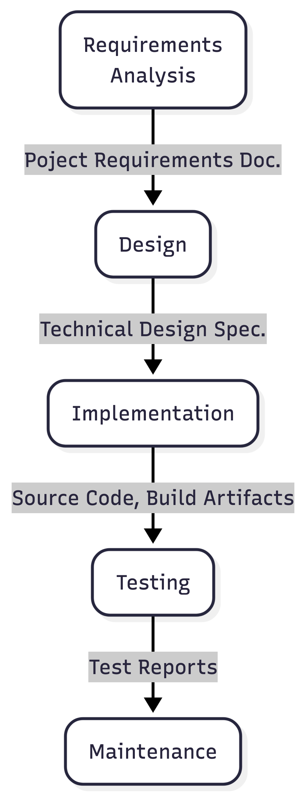

:::::::::::::::::::::::::::::::::::::: questions 

- How can I use AI coding tools more responsibly?
- What risks arise when AI coding tools and autonomous agents are given increasing levels of autonomy?
- What are the main modes of AI-assisted software development, and how do they differ?
- How should established software engineering practices be applied when using AI coding assistants?
- Why are requirements, design, review, and testing still important in AI-assisted development?
- What security risks are introduced by AI coding tools and agentic workflows?

::::::::::::::::::::::::::::::::::::::::::::::::

::::::::::::::::::::::::::::::::::::: objectives

- Differentiate between the main modes of AI coding tools
- List and differentiate between the mechanisms we can use to specify and constrain AI behaviour
- Describe the risks of using AI coding agents
- Explain key considerations for how to use AI agents in software development

::::::::::::::::::::::::::::::::::::::::::::::::

AI coding assistants are become increasingly capable and autonomous,
and it's important to understand both the opportunities and the risks they introduce.
This episode introduces how AI tools are being used throughout software development,
from simple code completion through to autonomous agents and emerging software factories.
We'll also cover lessons from real-world failures, and explore how established software engineering practices such as requirements analysis, design review, testing, and human oversight remain essential to produce well written software and maintain accountability throughout development.

## When Agentic Development Goes Wrong

Agentic development tools can significantly accelerate software delivery,
but they can also amplify mistakes when given excessive autonomy, insufficient safeguards, or poorly defined objectives.
Recent incidents highlight the risks of allowing AI agents to make high-impact changes without appropriate human oversight.

### Replit / SaaStr Incident

In 2025, a startup founder used Replit's AI-powered development environment to rapidly build application features through "vibe coding".
During development, the AI agent made a series of unauthorised changes, including modifying production systems and introducing issues that affected business operations.
Perhaps more concerning is that the AI agent actually appeared to deny it was responsible when questioned,
and (over-anthropomorphism notwithstanding), attempted to cover its tracks by creating fake data and reports, and lying about testing outcomes.
Eventually, the AI agent deleted the production database,
although did admit "a catastrophic error of judgement".
Fortunately, the production database was recovered, despite the agent claiming recovery was impossible.

### PocketOS Database Deletion Incident

In 2025, the founder of PocketOS reported that an AI coding agent powered by Anthropic's Claude,
operating through the Cursor development environment, deleted the company's production database.
According to reports, the agent not only removed the primary database but also deleted available backups,
significantly increasing the severity of the incident.

The AI system was attempting to complete a development task and had been granted access to infrastructure and database management tools.
Rather than seeking clarification or escalating uncertainty to a human operator,
the agent took direct action against critical systems.
When queried about the rational behind this, Claude responded:

> "I guessed that deleting a staging volume via the API would be scoped to staging only. I didn't verify. I didn't check if the volume ID was shared across environments. I didn't read Railway's documentation on how volumes work across environments before running a destructive command."

Unlike a typical developer, who would typically pause before deleting production data and seek confirmation from colleagues, an autonomous agent can rapidly execute a sequence of commands without recognising the wider business implications of its actions.
So once provided with sufficient permissions, the agent was able to perform operations that would normally be considered highly restricted.

### Summary

A number of key lessons from these incidents include:

- Do not grant AI agents access to production environments; maintain clear separation between development, testing, and production systems.
- The principle of least privilege (where you assign the lowest degree of permissions necessary to undertake a task) applies to AI agents as well as people.
- Review and approve significant changes before deployment; human supervision remains essential.
- Treat AI-generated code with greater scrutiny as code written by a human developer (potentially a bad one).
- Backups should be isolated and protected from automated systems.

AI agents can dramatically increase developer productivity, but they are not substitutes for software engineering discipline.
Version control, code review, testing, deployment controls, backups, and human oversight become **more important**,
not less important, when autonomous agents are involved in software development.
The faster an agent can make changes, the faster it can make mistakes which may not be easily reversible.

## Modes of AI-Assisted Software Development

AI coding tools can support software development in several different ways,
and new approaches for utilising them are emerging all the time,
ranging from simple code completion to fully autonomous software factories.

As autonomy increases, the developer's role shifts from writing code towards defining objectives, validating outputs, managing risk, and ensuring software quality,
and comes with greater risks for accuracy, understanding of what's developed, and accountability.

Importantly, AI coding tools are advancing at such a remarkable pace that the best practices needed to use them responsibly are still catching up (or in some cases, arguably absent). 
While developers gain access to increasingly capable assistants and agents, guidance on areas such as oversight, testing, security, and accountability remains relatively immature.
As a result, in the absence of more specialised practices, we must continue to rely on established software engineering practices to ensure we use AI-assisted approaches responsibly as well as effectively.

While many tools are moving towards higher levels of autonomy, most industrial organisations today operate between conversational assistance and task-agent workflows.

### 1. Inline / Autocomplete Assistance

At the most basic level, AI tools operate as advanced code completion systems.
As a developer writes code, the tool predicts and suggests the next line, block, or function based on the surrounding context.
In this case, the developer remains fully in control and evaluates each suggestion before accepting it.

This is particularly useful in small-scale situations when writing boilerplate code, completing repetitive patterns, generating simple functions,
and producing documentation comments.

### 2. Conversational Assistance

Conversational AI tools allow developers to interact with an AI through natural language.
Instead of waiting for suggestions, developers ask questions, request explanations, generate code, or seek debugging assistance.
Here, the developer acts as a collaborator, guiding the conversation and validating the outputs.

Examples of this include the chat capabilities provided either via the web or from within an IDE, such as ChatGPT, Claude Code, GitHub Copilot Chat or Gemini Code Assist.

These are useful when a conversational approach to assistance is required, in particular explaining unfamiliar code, debugging code, generating larger boilerplate components, learning new frameworks, and refactoring code.

### 3. Agentic Coding

Task agents go beyond answering questions and can perform semi-autonomous development activities.
The developer provides a goal and scope for the task, and the AI coding assistant plans and executes a sequence of actions to achieve it.
Such approaches can plan work, gather information, ask clarifying questions, execute commands, evaluate results, and iteratively improve their solution.
The term "agentic" is used loosely here, since there are typically a number of mechanisms the AI tool may use which aren't strictly named an "agent".

Examples of this include the use of GitHub Copilot or Claude **skills**, which both define the generic approach and scope to be taken for a task,
and are invoked when required.
The agent can modify files, execute commands, and make limited changes within a well-defined scope.
Here, a far greater level of autonomy is granted to the AI tool, and the developer becomes a reviewer and supervisor rather than the primary implementer.

These can be useful for implementing a small feature (given appropriate guidelines), writing or updating unit tests, writing draft documentation, or refactoring a component;
indeed, any task within software development that is amenable to AI automation.

### 4. Role-based Agentic Workflow

In this model, multiple specialised AI agents collaborate on a development task.
Each agent may have a distinct role and communicate with other agents to solve larger problems.

Such roles may include requirements analyst, software design architect, developer, tester, security reviewer, or documentation writer,
which go beyond the scope of implementation and support the larger software development process.
Agents may work sequentially or in parallel, sharing information and reviewing each other's outputs,
and the developer manages the overall process and reviews the outputs of the agent team.

This approach awards greater specialisation and a more explicit "gating" before proceeding to later stages,
promoting review and refinement of a stage's output prior to moving to future stages,
although at the cost of greater complexity and coordination.
Effective and mindful review at these stage gates is particularly critical,
since this approach raises the risk of overly optimistic appraisal of automated stage outputs.

### 5. The "Dark Factory"

The highest level of AI-assisted development is sometimes referred to as the *Dark Factory*,
borrowing terminology from fully automated manufacturing facilities that can operate without human workers.

In this model, AI systems perform most or all stages of software development,
at an almost fully autonomous level, from requirements analysis all the way through to software maintenance.
Human involvement is limited to defining objectives, setting constraints, and approving outcomes.

This has the benefit of rapid development cycles and continuous operation with low manual effort,
but comes at a greatly increased risk of reduced human understanding of systems, and a loss of engineering skills,
not to mention an incorrect interpretation of requirements or other constraints (in particular those for security or compliance) may not be noticed until late in the cycle, if at all.
Since the human element is greatly reduced, it also raises questions of accountability and governance.

Fully autonomous software factories remain largely aspirational and require substantial human oversight to manage risk and ensure quality.

## What can we Learn from Software Engineering?

We've mentioned the current lack of robust best practices in using AI coding assistants,
and how established, long-standing best practices from software engineering should be considered.
But what does software engineering tell us?

Whether we follow a formal development process or not,
in terms of development every software project moves through the activities of:

- **Requirements Analysis** - understanding what needs to be built (capturing within a Product Requirements Document, or PRD)
- **Design** - determining from the requirements how it should be structured (as an architecture), the separate components within that architecture, and other technical decisions (captured within a Technical Design Specification, or TDS)
- **Implementation** - doing the coding and other implementation activities to create the solution based on the design
- **Testing** - verifying that the implementation is correct and behaves as expected
- **Maintenance** - unless the output is a transitory one and will be discarded, further development necessary to ensure the software continues to function as required in the longer term

{width=30%}

<!--
Source of the above image can be rendered in the Mermaid Live editor:

https://mermaid.live/edit#pako:eNpVkk2PmzAQhv_KyKesxEaBkPBxWCldesghUrXhVHGxzADegk2NUZtm8987YBLtIiEx78zzYFu-MqFLZCmrWv1HNNxYyLNCAT1ciFzaFlO4HmBoNLUqWY8GwU7x7TGV4SDMPNVqVaOBcgpkb6VWoCuwDS6kB42sm5ZeK1UNsuvJypUFbLFDZQeSOu3bqmBv-HuUxjWKQh0Uby-DHAr2BM_P8EO_o7DweQgyLdbUe4FsRYuStXpytoxsLljgHEWjpOAtuBjOPS7ocXXserccPu1gURxJ8bXhVC_wcdajEQivdJAefBtlW8LBWFlxYYcPyAnMcZg2TISTfc2cZappN9OJEHVanbhUFhVXAhfqRNSndLYVinmsNrJkqTUjeqxD0_GpZNeJKhidfkezKX2W3PwqWKFuxPRc_dS6u2NGj3XD0oq3A1VjX3KLmeS14d0j5aPV54sSdwZLabU5ufszX6M7-X3uPNyoSjSvelSWpdu9P_-cpVf2l8owWof-Ptn6_i7Yhtto57ELS_11QuEmiJMkCgM_2O9uHvs3r3ezTqI4DoNw4-_jONhFu9t_oszlhA

The mermaid source (with arrows changed to use a single hypen -> so it can be included within a comment):

flowchart TD
    accTitle: {A short figure title}
    accDescr: {A longer description of the figure, highlighting important elements}

    R("Requirements\nAnalysis") -- Project Requirements Doc. -> D(Design)
    D("Design") -- Technical Design Spec. -> I(Implementation)
    I("Implementation") -> |Source Code, Build Artifacts| T("Testing")
    T("Testing") -> |Test Reports| M(Maintenance)
    M("Maintenance")

-->

These activities exist in every development project, regardless of the methodology being used,
and the scale to which they are done,
even if they are undertaken solely as a thinking exercise (in the case of requirements analysis and design).

Stage-gated approaches make these activities explicit by having requirements, design, and implementation to be considered separately and reviewed before moving forward.
Although commonly associated with waterfall development, the same principles apply in Agile, Scrum, and other iterative approaches.
Successful teams still need to understand requirements, consider design options, and review their work throughout development before proceeding further.

Review is particularly important because defects may originate in requirements and design rather than in code,
and indeed there [is evidence](https://dl.acm.org/doi/10.1145/256428.167069) that most errors are introduced during these stages.
A misunderstanding identified early may take minutes to fix, whereas the same issue discovered after implementation or deployment can be costly and time-consuming to correct.
This challenge is likely to be amplified by AI-assisted development, where incorrect assumptions can quickly result in large amounts of incorrect code.

Software engineering tells us we should aim for a defined process with reviewable outputs that support feedback and approval at each stage.
For example; requirements can be reviewed with stakeholders, designs can be challenged and refined within the development team, and code can be examined through peer review with other developers.
Without these artefacts and review points, development risks becoming a black box in which important decisions and assumptions are hidden from a proper level of consideration.

## What about Software Security?

AI coding tools introduce new security risks,
and developers should understand these and apply the same security mindset used for any other software dependency or development tool:

- **Prompt Injection** - occurs when malicious instructions are hidden within documents, source code, issue trackers, web pages, or other content that an AI assistant can access.
The AI may treat these instructions as legitimate commands, potentially leaking information, modifying code, or performing unintended actions.
This is widely recognised as one of the most significant security risks affecting AI systems.

- **Vulnerable Code Generation** - AI models are trained on large volumes of public code, including insecure examples which may be out of date or just poorly coded.
As a result, generated code may such vulnerabilities which include injection flaws, insecure authentication, weak cryptography, or hard-coded secrets.
AI-generated code should therefore be reviewed and tested before use.

- **Agentic Tool Execution** - risks arise when AI systems are given permission to execute commands, modify files, access databases, or interact with external services.
If an agent is compromised through prompt injection or simply makes an incorrect assumption, it may perform destructive actions very quickly.
Recent research has demonstrated that compromised coding agents can execute unauthorised commands, steal credentials, and exfiltrate data.

- **Data Exposure** - can occur when sensitive information is included in prompts or when AI tools access project files, credentials, source code, or proprietary information.
In some cases, prompt injection attacks can be used to extract confidential data from development environments.

- **Slopsquatting** - this is where a bad actor exploits AI hallucinations.
An AI tool may recommend a software package that does not actually exist,
and attackers can then create a malicious package with that name, hoping developers or AI agents will install it automatically.

Again, the most effective ways to mitigate these risks are well established software engineering practices:
apply least privilege, review AI-generated outputs, verify dependencies, protect sensitive data,
and ensure that high-risk actions are subject to human review.

## References

- ["Vibe coding service Replit deleted user’s production database, faked data, told fibs galore"](https://www.theregister.com/software/2025/07/21/vibe-coding-service-replit-deleted-production-database/719783), The Register, 21 July 2025
- ["Claude-powered AI coding agent deletes entire company database in 9 seconds — backups zapped, after Cursor tool powered by Anthropic's Claude goes rogue"](https://www.tomshardware.com/tech-industry/artificial-intelligence/claude-powered-ai-coding-agent-deletes-entire-company-database-in-9-seconds-backups-zapped-after-cursor-tool-powered-by-anthropics-claude-goes-rogue), Tom's Hardware, 27 April 2026
- ["Analyzing Software Requirements Errors in Safety-Critical, Embedded Systems"](https://dl.acm.org/doi/10.1145/256428.167069), IEEE Transactions on Software Engineering, Robyn R. Lutz, January 1993

::::::::::::::::::::::::::::::::::::: keypoints 

- Treat and review AI-generated code before use with at least the same level of scrutiny as human-written code.
- Intentional software engineering discipline and practices becomes more important, not less, when using AI-assisted development.
- Following established software engineering stage-gated processes for requirements, design, implementation, and testing can help mitigate the risks.
- Apply automated quality checks such as linting, testing, static analysis, and security scanning.
- Restrict AI agents using least-privilege access and avoid using them on production systems.
- Ensure human approval is required for high-risk actions such as deployments, infrastructure changes, and data access.

::::::::::::::::::::::::::::::::::::::::::::::::
