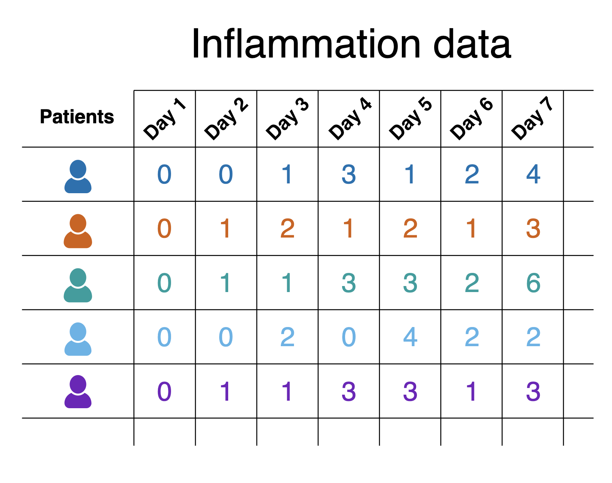

:::::::::::::::::::::::::::::::::::::: questions 

- How do I obtain the coding, data, or other resources I need to do this course?
- How do I prepare Visual Studio Code for this activity?
- How do I constrain Copilot's suggestions to a defined set of coding standards and behaviours?

::::::::::::::::::::::::::::::::::::::::::::::::

::::::::::::::::::::::::::::::::::::: objectives

- Clone example repository onto local machine
- Describe the example coding scenario that will be used throughout this course
- Define constraints and coding practices for this project for Copilot to follow

::::::::::::::::::::::::::::::::::::::::::::::::

## An Example Coding Scenario

### Obtaining the Example Repository

For this lesson we'll be using some example data held in a repository on GitHub,
which we'll clone onto our machines using the Bash shell.
So firstly open a Bash shell (via Git Bash in Windows or Terminal on a Mac).
Then, on the command line, navigate to where you'd like the example code to reside,
and use Git to clone it.
For example, to clone the repository in our home directory,
and change our directory to the repository contents:

```bash
cd
git clone https://github.com/Southampton-RSG-Training/advanced-ai-coding-example.git
cd advanced-ai-coding-example
```

### Setting up VSCode for our Project

Start by running VSCode now on your machine,
and open our downloaded directory within it as a VSCode workspace.

You can do this in a couple of ways, either:

1. Select the `Source control` icon from the middle of the icons on the left navigation bar. You should see an `Open Folder` option, so select that.
1. Select the `File` option from the top menu bar, and select `Open Folder...`.

In either case, you should then be able to use the file browser to locate the directory with the files you just extracted, and then select `Open`.
Note that we're looking for the *folder* that contains the files, not a specific file.

We also need to ensure that the Copilot extension is installed and activated.
It's installed by default on newer releases of VSCode,
so may not be installed on older installations.

1. Firstly, select the extensions icon, then type in "Copilot" into the search box at the top, and it'll give you a list of all Copilot-related extensions.
1. Select the one which says `GitHub Copilot` from GitHub, which is the official Copilot extension. You may also see the `GitHub Copilot Chat` extension, which is automatically installed along with this one.
1. Either:
   - It says `Installed`, in which case you don't need to do anything.
   - It says `Install`, in which cae select that button to install it. It might take a minute - you can see a sliding blue line in the top left to indicate it's working. You'll be presented with a "Welcome" page for the extension which covers the main features. Select `Mark Done`.

We also need to ensure we're logged into our GitHub account.
You should see a GitHub-looking icon in the status bar at the bottom right of VSCode's window.

1. Select the `Signed out` button in the bottom right of the VSCode status bar, and `Sign in to use AI Features`.
1. Select `Continue with GitHub`.
1. You'll be redirected to a GitHub login web page to authorise Visual Studio Code for GitHub. Select the GitHub account you wish to use and select `Continue`.
1. Peruse and select `Authorize Visual-Studio-Code`.
1. You may need to further authenticate with GitHub authorise this action.
1. If a pop-up appears in your browser to open a link within VSCode, select `Open Link`.

Once completed, you'll now be able to use GitHub Copilot within VSCode.

### The Scenario

The scenario involves studying the effects of a new treatment for arthritis
by analysing the inflammation levels in patients who have been given this treatment.
There are a number of datasets in the `data/` directory that each contain the result from a separate clinical trial of the drug.
Each dataset contains recorded measurements of inflammation from 60 patients over the course of a 40 day trial.

{alt='Snapshot of the inflammation dataset' .image-with-shadow width="800px" }

Each of the data files uses the popular
[comma-separated (CSV) format](https://en.wikipedia.org/wiki/Comma-separated_values)
to represent the data, where:

- Each row holds inflammation measurements for a single patient
- Each column represents a successive day in the trial
- Each cell represents an inflammation reading on a given day for a patient

The goal of the project is to create a software tool that provides basic statistical analyses (mean value, minimum value, maximum value, and standard deviation),
for a given dataset.
The project has a few constraints, specifically that it must be written in Python and use the Numpy and Matplotlib Python libraries,
since the group already has expertise using these technologies and they'll wish to extend it further.

### Setting up a Virtual Environment

For this scenario we are constrained to using Numpy and Matplotlib,
which we'll install before we start developing our code with Copilot's assistance.
We're going to create what's known as a virtual environment to hold these packages.

:::::::::::::::::::::::::::::::::::::::::::::::: instructor

## Installing Python Packages

Who has created and used a Python virtual environment before?

:::::::::::::::::::::::::::::::::::::::::::::::::::::::::::

::::::::::::::::::::::::::::::::: callout

## Benefits of Virtual Environments

Virtual environments are an indispensible tool for managing package dependencies across multiple projects,
and could be a whole topic itself.
In the case of Python, the idea is that instead of installing Python packages at the level of our machine's Python installation,
which we could do,
we're going to install them within their own "container",
which is separate to the machine's Python installation.
Then we'll run our Python code only using packages within that virtual environment.

There are a number of key benefits to using virtual environments:

- It creates a clear separation between the packages we use for this project,
and the packages we use other projects.
- We don't end up with a machine's Python installation containing a clutter of a thousand different packages,
where determining which packages are used for which project often becomes very time consuming and prone to error.
- Since we are sure what our code actually needs as dependencies,
it becomes much easier for someone else (which could be a future version of ourselves) to know what these dependencies are and install them to use our code.
- Virtual environments are not limited to Python; for example there are similar tools for available for Ruby, Java and JavaScript.

:::::::::::::::::::::::::::::::::::::::::

Make sure you're in the root directory of the repository, then type

```bash
python3 -m venv venv
```

Here, we're using the built-on Python `venv` module - short for virtual environment - to create a virtual environment directory called "venv".
We could have called the directory anything, but naming it `venv` (or `.venv`) is a common convention,
as is creating it within the repository root directory.
This makes sure the virtual environment is closely associated with this project, and not easily confused with another.

Once created, we can *activate* it so it's the one in use:

```bash
[Linux] source venv/bin/activate
[Mac] source venv/bin/activate
[Windows] source venv/Scripts/activate
```

You should notice the prompt changes to reflect that the virtual environment is active, which is a handy reminder. For example:

```output
(venv) $
```

Now we have our virtual environment, we can install NumPy and Matplotlib to it:

```bash
python -m pip install numpy matplotlib
```

If we do `python -m pip list` now, we can see these packages, and their dependencies, installed within the virtual environment we have activated.

If we want to deactivate this environment, and return to the global Python package context,
we can use `deactivate`.
To reactivate it again, it's the same as before:

```bash
[Linux] source venv/bin/activate
[Mac] source venv/bin/activate
[Windows] source venv/Scripts/activate
```

## Personalising Copilot to Match our Project

### What is an Instructions File?

GitHub Copilot can be personalised by adding a instructions file to a repository that tells Copilot how you want it to behave in that project.
The file acts as persistent, project-level guidance for Copilot, covering things like:

- Preferred architecture and design patterns
- Coding style and naming conventions
- Approved or banned libraries
- Testing expectations and quality standards
- Security or safety rules
- How detailed Copilot’s answers should be

By giving Copilot this shared context we can specify the developer's (or developer team’s) coding conventions, reuse existing patterns, and avoid unwanted approaches, with the aim to make its suggestions more relevant for a particular project.

It serves a similar purposes to a `CONTRIBUTING.md` file in a code repository;
it provides guidance for how suggestions, code changes and contributions should be made,
but aimed at Copilot's day-to-day decisions instead.
It does this by adding context to queries from the `.github/.copilot-instructions.md` file.

For example, if we were to ask Copilot "How should I make this code more readable?",
without instructions Copilot may suggest to:

- Rename or format variable or function names inconsistently
- Change behaviour subtly in an undesired way
- Use an indentation style that isn't typically used by team members
- Without instructions, Copilot may introduce a new design pattern the repository doesn't use

### Create an Instructions File

FIXME: change to manual creation, since there's no code anyway.
FIXME: use example in https://dev.to/anchildress1/all-ive-learned-about-github-copilot-instructions-so-far-5bm7 as basis.
FIXME: focus on goals for the app (high-level scenario description), data safety (i.e. don't change anything in data/), technology stack, dev guidelines, coding style standards (e.g. PEP8, comments and docs (commenting strategy, include a README in the repository)
FIXME:   include never hardcode security and secrets
FIXME: keep sections very short. write a section or two, get them to write another

### Specifying Privacy per File Type

In VS Code, GitHub Copilot gives developers some mechanisms to control the level of privacy.
This should be considered important where our code uses sensitive or otherwise confidential data,
or potentially valuable IP-related code, such as algorithms.

At a high level, Copilot works by sending small, relevant snippets of your open code (plus surrounding context) to the Copilot service to generate suggestions.
You don’t explicitly "upload a project", but you do control which files Copilot is allowed to see and draw context from.

The most practical control is scoping Copilot by file, folder, or workspace.
In VS Code you can disable Copilot entirely, or selectively turn it off for particular file types (for example, configuration files, data files, or notebooks).

For example, we edit our VSCode settings to ignore csv files by:

1. Using `Ctrl + Shift + P` or `Cmd/Windows Key + Shift + P` to open the Command Palette
1. Entering and selecting `Preferences: Open User Settings (JSON)`
1. In the `settings.json` file that appears, add the following and save the file:

   ```yaml
      "github.copilot.enable": {
         "*": true,
         "csv": false
      }
   ```

This will have the effect of potentially including all file types in context by default,
but not CSV files.

::::::::::::::::::::::::::::::::::::::::: instructor

## Checkpoint: I've disabled the inclusion of csv files

::::::::::::::::::::::::::::::::::::::::: 

If you wanted a stricter "default deny" approach instead, you could specify `false` for `*` and enable each filetype explicitly.

There are stricter controls, including some that allow exclusion by directory specifications,
but these are currently limited to Copilot Business users for their repositories and organisations.

::::::::::::::::::::::::::::::::::::: keypoints 

- FIXME

::::::::::::::::::::::::::::::::::::::::::::::::
