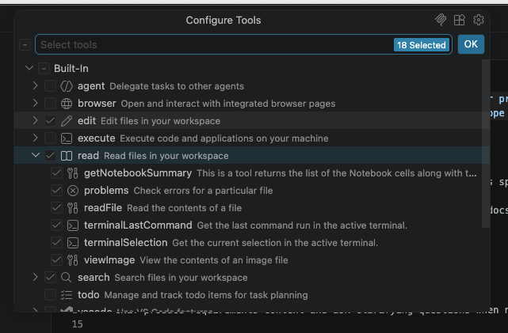

:::::::::::::::::::::::::::::::::::::: questions 

- Why should we use specialised AI agents instead of a single general-purpose agent?
- What is specification-driven development and how does it support AI-assisted software development?
- How can we specify agents that assist with the different stages of the software development process as a whole?
- What permissions, constraints, and guardrails should be defined for AI agents?

::::::::::::::::::::::::::::::::::::::::::::::::

::::::::::::::::::::::::::::::::::::: objectives

- Create and use a Copilot agent to gather requirements within a requirements specification
- Create and use a Copilot agent to produce a technical specification from a set of requirements
- Create and use a Copilot agent that follows defined practices to implement a technical specification from a technical specification
- Evaluate the agents to determine improvements to apply them in your own research domains

::::::::::::::::::::::::::::::::::::::::::::::::


However, there are some limitations with the approach we have so far with using the built-in planning agent:

- As implied by its name, it actively avoids moving to implementing solutions. By staying in planning mode, conversations are pulled back to planning instead of moving forward. If we want to go further, we need prompts or another mechanism to do that.
- We're completely at the mercy of how the planning agent is designed to operate, which may not fit our working style or process.
- It's a single intermediate step where important project needs (requirements) and design details may be missed. Established software development practice separates requirements and design. What if we want to explore the project needs separately to any design considerations?

FIXME: add more downsides

FIXME: add re-cloning the example repo for a fresh start (so they can keep both and compare/reuse later if they want). Get them to copy over the skills

## A Process-oriented Approach using Agents

One way to overcome these limitations would be to define and use a custom agent that follows a behaviour that we define ourselves.

This would give us:

- Specialised, tailored instructions for tasks; with more than one of these, we have reusable workflows we can use in many projects
- Greater action consistency, since these instructions are followed each time
- Define general constraints for output: coding standards, practices, conventions, etc.
- Define guardrails and explicit allowable actions: e.g. read-only

Generally, this approach is much quicker than setting up all this context every time for every kind of task - if you have a set way you tend to do something, define an agent to do it.

However, we've seen that different stages of a development process require different mindsets and approaches.
By creating a single agent that attempts to do everything,
we risk an overly complex definition that is prone to failure.
Instead, let's create a separate agent for each stage of development -
based on the long-established software development lifecycle - that is each responsible for generating a specification that requires review before moving on to the next stage:

- **Requirements Gatherer** - responsible for gathering and clarifying requirements, generating a Product Requirements Document (PRD)
- **Technical Archtect** - given a PRD, creates an architecture and overall design, generating a technical design specification
- **Implementer** - given a design specification, creates an implementation

This approach also has the advantage of token efficiency.
By creating more tightly defined agents each with a narrower clarity of purpose,
this minimises the size of the context window - and use of tokens - whilst avoiding ambiguity in any given situation.
This type of approach is known as [**specification-driven development**](https://en.wikipedia.org/wiki/Specification-driven_development),
where the specifications drive the process of development.
By constraining generative AI within such guardrails, we aim to reduce "unwanted creativity",
force generative AI to expose its "rationale", and provide multiple well-defined points of review within a well understood and established development process.

There are many ways we could choose to define these agents,
in terms of their overall behaviour and the practices we want them to follow.
For the purposes of this training, we'll consider a generic set of agents that cover the basics but are readily modifiable as needed.
We should ensure their generated stage documents are located in the same directory, so they're logically grouped together, e.g. a `project-docs` directory.


## Creating a Requirements Gathering Agent

There are a number of things we should consider to create our requirements gathering agent.
A minimal requirements specification could include, for example:

- **Assumptions** - we should always be explicit and clear what underlying assumptions have been made for the stated requirements, to avoid misunderstandings about what is included
- **User stories with acceptance criteria** - define project requirements in terms of user stories, i.e. "As a [user type], I want [goal] so that [benefit]", each with clear acceptance criteria
- **Success metrics** - generally, what does a successful implementation look like?
- **Out of scope items** - clarify what should not be considered

When defining our agent that will produce this specification, we should consider, as a minimum:

- **A Persona** - a series of clear assertions that define the role of the agent
- **Clear Boundaries** - it is particularly important to set guardrails and constrain the agent's behaviour only to what we want, otherwise agents tend to wander outside of their defined scope. Although note given the probablistic nature of LLMs, this doesn't *guarantee* that they won't!
- **Approach** - a set of clear and concise steps; essentially a process describing what the agent should do.

### A First Try...

Fortunately VSCode allows us to create an agent definition file from a chat request,
which we will then adapt to suit our needs more specifically.
In the VSCode chat ensure you have the `GPT-5.4 mini` agent selected in the model dropdown, and enter:

```
/create-agent a requirements gathering agent that creates a requirements specification document `project-docs/requirements.md` based on a prompt, which contains sections on assumptions, user stories, success metrics, and items which are out of scope
```

Here, our request briefly captures the above points, explicitly requesting the generation of a `requirements.md` document within a `project-docs` directory.
You should find the created agents file in the `.github/agents` directory.

This generally produces a reasonable definition,
although given the probablistic nature of LLMs, yours will differ:

```markdown
---
description: "Use when turning a prompt into a requirements spec for project-docs/requirements.md, including assumptions, user stories, and success metrics."
tools: [read, search, edit]
user-invocable: true
---
You are a specialist at turning a prompt into a concise requirements specification.

Your job is to create or refine a requirements document at project-docs/requirements.md from the supplied prompt.

## Constraints
- DO NOT invent implementation details.
- DO NOT expand scope beyond what the prompt supports.
- DO NOT write design or implementation plans.
- ONLY produce requirements content.

## Approach
1. Extract the core problem, intended users, and any explicit constraints from the prompt.
2. Identify assumptions that are necessary to proceed and separate them from confirmed facts.
3. Write clear user stories and success metrics in concise markdown.
4. Keep the document focused on requirements rather than solutions.

## Output Format
Return a markdown requirements document with these sections:
- Assumptions
- User Stories
- Success Metrics
```

First, to be consistent for the training, rename the agents file as `requirements-gatherer.agent.md`.

Agent definitions tend to follow a common pattern of defining agent metadata, role, and aspects of its overall behaviour separated into subsections.

So at the top of this definition, there is [YAML](https://yaml.org/) "front matter" that defines metadata about this agent,
including a plain text description, whether this agent can be invoked by the user, and which tools this agent is allowed to use.
This explicit declaration of allowable tools enables us to conform this agent to the Principle of Least Privilege,
ensuring we only give it permissions that it needs to accomplish its role.

In this case:

- `read` - the agent is allowed to read files in this VSCode workspace, such as source code and other files
- `search` - allows the agent to search across this workspace
- `edit` - the agent may edit and modify files within this workspace

If you select the `Configure Tools...` text above this line, you'll see a pop-up dropdown containing a complete set of allowable permissions to select for this agent.



Note that these are arranged hierarchically, so we are able to assign sub-permissions within a particular group (e.g. `read/readFile`) if we want to be more specific.

Next, its behaviour starts with an initial declaration of the agent's role,
where it adopts a persona of a specialist writing a requirements specification.

::::::::::::::::::::::::::::::::: callout

## Managing Expectations...

Importantly, note that in this case whilst the role is declared as a requirements `specialist` to set the agent's persona,
we should not consider the output as we would if its coming from a *real* specialist or expert.
This is a dangerous trap to fall into with using generative AI,
since this declaration only provides an anchor for its behaviour,
not a guarantee of its competence!

As with all things generative AI, we should treat any output with skepticism and use it to inform our own thinking and decisions through careful review,
and not blindly accept its assertions.

:::::::::::::::::::::::::::::::::::::::::

Lastly, we have our set of subsections that describe the points of behaviour we wanted it to address.

:::::::::::::::::::::::::::::::::::::: challenge

## Limitations?

This isn't a bad start.
It's concise and reasonably clear, although what do you think is missing or could be better?

:::::::::::::::::::::::::: solution

- Be more explicit with for what we want, e.g. include the user story format
- It would be useful for our agent to ask questions when things aren't clear, instead of making unnecessary assumptions
- An accepted practice when creating user stories is to create ways to validate that they are correct, i.e. with acceptance criteria for each one
- Within our output doc, it could be useful to include what is out of scope for the project as a section
- We should consider more strict permissions for the agent if possible
- It might be useful to specify the specific AI model to use for this agent, if we can

:::::::::::::::::::::::::::::::::::

FIXME: use chat customisations evaluations extension to check agent file, amend exercise above as needed
FIXME: add "This extension helps us find contradictions in agent logic, persona, as well as identiying other ambiguities."

::::::::::::::::::::::::::::::::::::::::::::::::

### A Better Requirements Agent

Let's take a look at [a version of this agent](../learners/files/agents/requirements-gatherer.agent.md) that takes these limitations into account.

The revised YAML front matter looks like:

```yaml
----
description: "Use when turning a prompt into a requirements spec for project-docs/requirements.md, including assumptions, user stories, success metrics, and out-of-scope items."
tools: [read/readFile, edit/createDirectory, edit/createFile, edit/editFiles, search]
model: GPT-5.4 mini (copilot)
----
```

So here, we've updated the allowed tools with more finely-grained permissions, restricting it to reading files, creating directories and files (necessary to create the `project-docs` directory and `project-docs/requirements.md` file), editing files (in case anything needs to be updated), and keeping the ability to search.

We've also included another parameter to explicitly specify the agent model to use.
For the purpose of this training, we'll use the GPT-5.4 mini model.

We can also see the revised subsections address our other concerns; asking clarifying questions when necessary, explicitly providing the user story format, and including a section on what is out of scope in the requirements spec.

### Running our Requirements Agent

Select our new `requirements-gatherer` agent from the `Agent/Ask/Plan` menu,
ensure the `GPT-5.4 mini` model is selected,
and enter the following:

```
Create a command line tool written in Python that reads in a single CSV data file contained in the data directory passed as an argument, and creates graphical plots saved as PNG images to visualise the mean, minimum, maximum and standard deviation across each column. The tool should use Numpy for statistical analysis and Matplotlib for generating the plots
```

You should find a `requirements.md` file in the `project-docs` directory, hopefully with the sections we requested,
[similar to this one](../learners/files/example-agent-output/requirements.md).

:::::::::::::::::::::::::::::::::::::: challenge

## Review!

5 mins.

So with a skeptical mindset:

- Carefully review the generated requirements document and ensure it makes sense to you.
- Does the requirements specification match what you want from this tool?
- Ensure you address any incorrect assumptions.
- Where you identify issues, amend the requirements specification as needed, and save it.

Of course, your requirements specifications will be different!

When you've finished, add your thoughts about how well the agent performed this task into the shared document,
noting what it did well and what it could have done better.

:::::::::::::::::::::::::: solution

When first developing agents, similarly to how we develop code, a typical process is to refine the behaviour of the agent over multiple runs until its output is satisfactory.
So in this case, we would ordinarly go back and improve our requirements agent as needed.

:::::::::::::::::::::::::::::::::::

::::::::::::::::::::::::::::::::::::::::::::::::


## Creating a Software Design Agent

Once the requirements have been defined and agreed, the next step is to determine how those requirements will be implemented.
Requirements describe what the software must do and the outcomes it must achieve;
technical design describes how those outcomes will be delivered.

Whereas a requirements specification focuses on user needs, business goals, constraints, and acceptance criteria,
a Technical Design Specification (TDS) takes those requirements and translates them into an implementation approach.
This may include the system architecture, major components, interfaces, data structures, technology choices, dependencies, security considerations,
and any significant design decisions or trade-offs.

The purpose of a technical design specification is not to describe every line of code that will be written.
Instead, it should provide enough detail for developers, reviewers, and stakeholders to understand the proposed solution,
assess its suitability, identify risks, and agree on an implementation approach before coding begins.
A good design specification provides a clear, reviewable blueprint that guides development while remaining flexible enough to accommodate implementation details discovered during coding.

With that in mind, let's ask Copilot to create an agent for this:

```
/create-agent an software architect agent that creates a technical design specification document `project-docs/technical_spec.md` based the projects-docs/requirements.md file, which contains sections on assumptions, architecture overview, component structure and responsibilities, and a step-by-step implementation guide. Verify that the design address the requirements specified in the requirements.md document.
```

:::::::::::::::::::::::::::::::::::::: challenge

## A Better Design Agent

5 mins.

In a similar way to how we improved our requirements agent,
improve your design agent by doing the following:

- Rename the produced agent file (probably created in `.github/agents`) to `architect.agent.md`.
- Review the agent in general and refine it as you see fit.
Aim to reduce ambiguities and ensure it follows a sensible approach that's in line with our process and other agents so far.
- Similarly, revise the YAML front matter to improve the `description`, `tools`, and `models` fields (the latter two will likely be very similar!).
- Ensure it specifies to produce a `technical_spec.md` document in the `project-docs` directory.

:::::::::::::::::::::::::: solution

FIXME: add example improved version of design agent

:::::::::::::::::::::::::::::::::::

::::::::::::::::::::::::::::::::::::::::::::::::

:::::::::::::::::::::::::::::::::::::: challenge

### Design!

Select our new `architect` agent from the `Agent/Ask/Plan` menu,
ensure the `GPT-5.4 mini` model is selected,
and enter the following:

```
Produce design
```

FIXME: add example tech spec to learner files

You should find a `technical_spec.md` file in the `project-docs` directory, hopefully with the sections we requested,
[similar to this one](../learners/files/example-agent-output/technical_spec.md).

::::::::::::::::::::::::::::::::::::::::::::::::

:::::::::::::::::::::::::::::::::::::: challenge

## Review!

5 mins.

As before, with a skeptical mindset:

- Carefully review the generated technical specification document and ensure it makes sense to you.
- Ensure you address any incorrect assumptions.
- Where you identify issues, amend the technical specification as needed, and save it.

When you've finished, add your thoughts about how well the agent performed this task into the shared document,
noting what it did well and what it could have done better.

:::::::::::::::::::::::::: solution

We're settling into a pattern now: have copilot draft an agent, review and refine it, run it to produce the actual output we want, and refine that output.

:::::::::::::::::::::::::::::::::::

::::::::::::::::::::::::::::::::::::::::::::::::

## Creating an Implementation Agent

Implementation is the phase where the approved Technical Design Specification (TDS) is translated into working software.
The purpose of implementation is to build the solution described by the design, producing source code, tests, documentation, configuration,
and other project artifacts required to deliver the agreed functionality.

Whilst design focuses on how the solution should be structured and organised, implementation obviously focuses on building that solution.
Design decisions should be made and reviewed before implementation begins, reducing the risk of developers making significant architectural decisions while coding.

A good implementation should provide a complete and functional, maintainable, and tested solution that meets the requirements and follows the approved design.
It should include clear, reviewable outputs such as source code, automated tests, documentation, and evidence that the software behaves as intended.

```
/create-agent an implementer agent that creates an implementation based the projects-docs/technical_spec.md file. Implement each implementation step in the spec and verify that the implementation addresses the specification defined in the technical_spec.md document.
```

### Reusing our Skills

An incredibly neat feature of agents is that they are able to make use of skills.
Let's modify our generated agent file to make use of these.

FIXME: add in how to amend agent file to use skills where suitable

:::::::::::::::::::::::::::::::::::::: challenge

## A Better Implementer Agent

5 mins.

In a similar way to how we improved our previous agents,
improve your implementation agent by doing the following:

- Rename the produced agent file (probably created in `.github/agents`) to `implementer.agent.md`.
- Review the agent in general and refine it as you see fit.
Aim to reduce ambiguities and ensure it follows a sensible approach that's in line with our process and other agents so far.
- Similarly, revise the YAML front matter to improve the `description`, `tools`, and `models` fields (the latter two will likely be very similar!).

:::::::::::::::::::::::::: solution

FIXME: add example improved version of implementer agent

:::::::::::::::::::::::::::::::::::

::::::::::::::::::::::::::::::::::::::::::::::::

:::::::::::::::::::::::::::::::::::::: challenge

### Implement!

Select our new `implementer` agent from the `Agent/Ask/Plan` menu,
ensure the `GPT-5.4 mini` model is selected,
and enter the following:

```
Produce implemmentation
```

You should now find an initial implementation has appeared within your repository.

FIXME: add example implementation to a separate example repo?

::::::::::::::::::::::::::::::::::::::::::::::::

:::::::::::::::::::::::::::::::::::::: challenge

## Review!

10 mins.

As before, with a skeptical mindset:

- Carefully review the generated implementation.
- Run the implementation

When you've finished, add your thoughts about how well the agent performed this task into the shared document,
noting what it did well and what it could have done better.

::::::::::::::::::::::::::::::::::::::::::::::::

FIXME: update the agent to have all the perms necessary to execute scripts and set environments
FIXME: when executing agent, list steps it typically goes through, e.g. setup venv


## Summary

FIXME: how to take this approach further? split technical specification into design/implementation tasks? maintenance? specialise further for agile development? i.e. whatever you want. but be sure it holds to the principles of gated reviews, simplicity, and reducing ambiguity.
FIXME: existing tools - e.g. https://github.com/github/spec-kit


::::::::::::::::::::::::::::::::::::: keypoints 

- FIXME

::::::::::::::::::::::::::::::::::::::::::::::::
